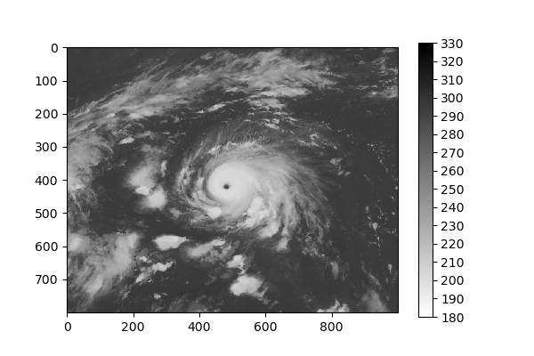
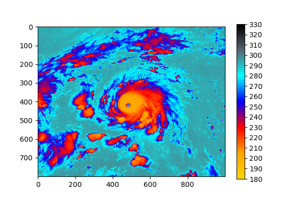
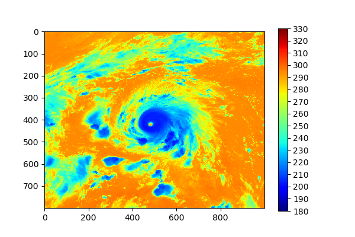
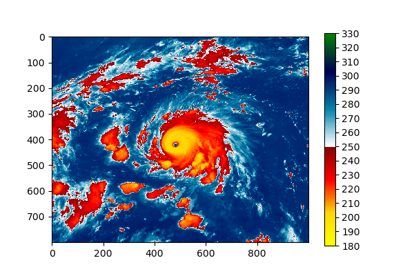
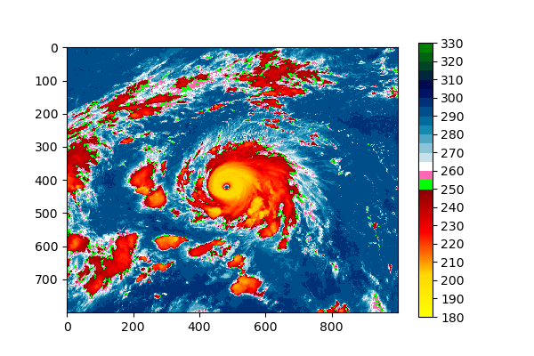
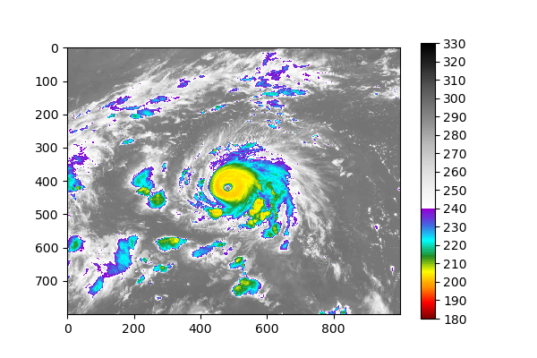
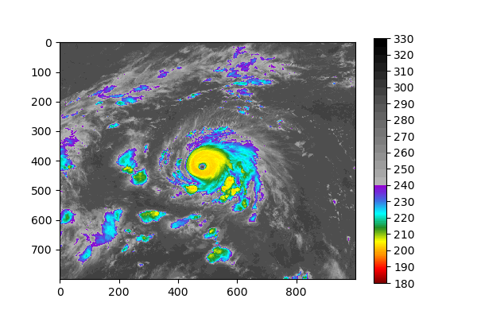

# Custom_colors_palette
Python script to create a custom colors palette.

# Requirements
- Numpy
- Matplotlib

# Usage
Let us suppose you have this satellite image of brightnes temperature (in Kelvin) and you want view it with a custom color palette.



An easy way to do this is by using the **custom_color_palette** package. Take a look at the following examples.\
\
First, let us import the packages and read the satellite image.
```
import numpy as np
import matplotlib.pyplot as plt
import matplotlib.colors as colors
import custom_color_palette as ccpl

SatImg = np.fromfile('SatImage.bin', dtype='float32').reshape((800,1000))
```
\
Then, we called the **creates_palette** module from package alias (**ccpl**) and pass it two parameters. The first parameter is a list containing a sub-list with colors names and the second parameter is a list with the range of palette values.
You can use the matplotlib's colors names defined [here](https://matplotlib.org/examples/color/named_colors.html) or you can create your custom color palette using the Hex color code or the RGB color code, as seen in the following example.
```
mypalette, colorslabels = ccpl.creates_palette([['gold','orange','red','blue','cyan','#5A6673',(0/255, 0/255, 0/255)]], [180.0,330.0])
```
\
Use the outputs to set the norm parameter.
```
norm = colors.BoundaryNorm(colorslabels, ncolors=mypalette.N)
```
\
Then create an array with the custom tickslabels and show de image. Do not forget you add spacing='proportional' to the colorbar.
```
tickslabels = np.arange(180,340,10)

fig = plt.figure('example01', figsize=(6,4), dpi=100)
img = plt.imshow(SatImg, cmap=mypalette, norm=norm)
cbar = plt.colorbar(img, spacing='proportional', ticks=tickslabels)
cbar.ax.set_yticklabels(tickslabels)
plt.show()

```

\
\
You can also use the matplotlib's colors palette defined [here](https://matplotlib.org/tutorials/colors/colormaps.html) and custom it.
```
mypalette, colorslabels = ccpl.creates_palette([plt.cm.jet], [180.0,330.0])

norm = colors.BoundaryNorm(colorslabels, ncolors=mypalette.N)
tickslabels = np.arange(180,340,10)

fig = plt.figure('example02', figsize=(6,4), dpi=100)
img = plt.imshow(SatImg, cmap=mypalette, norm=norm)
cbar = plt.colorbar(img, spacing='proportional', ticks=tickslabels)
cbar.ax.set_yticklabels(tickslabels)
plt.show()

```

\
\
On the other hand, if you want to merge your custom color palette with the Matplotlib's color palette, you can do it as follows.
```
mypalette, colorslabels = ccpl.creates_palette([['yellow','orange','red','darkred'], plt.cm.ocean_r], [180.0,250.0,330.0])

norm = colors.BoundaryNorm(colorslabels, ncolors=mypalette.N)
tickslabels = np.arange(180,340,10)

fig = plt.figure('example03', figsize=(6,4), dpi=100)
img = plt.imshow(SatImg, cmap=mypalette, norm=norm)
cbar = plt.colorbar(img, spacing='proportional', ticks=tickslabels)
cbar.ax.set_yticklabels(tickslabels)
plt.show()

```

\
\
In addition to that, if you want your palette to have colors that do not change its tone, you can do it by adding sublists with the name of the color you want, as shown below.
```
mypalette, colorslabels = ccpl.creates_palette([['yellow','gold','red','darkred'], ['lime'], ['hotpink'], plt.cm.ocean_r], [180.0,250.0,255.0,260.0,330.0])

norm = colors.BoundaryNorm(colorslabels, ncolors=mypalette.N)
tickslabels = np.arange(180,340,10)

fig = plt.figure('example04', figsize=(6,4), dpi=100)
img = plt.imshow(SatImg, cmap=mypalette, norm=norm)
cbar = plt.colorbar(img, spacing='proportional', ticks=tickslabels)
cbar.ax.set_yticklabels(tickslabels)
plt.show()

```

\
\
In the case you want to change the spacing between the colors, you can do it using **Increase** parameter. This parameter is optional and its default value is 1.0. The nexts lines show an example where add Increase=[1.0, 1.0, 5.0 5.0] in **creates_palette** with purpose of set the colors of each palette. In this example the spacing of the first colors palette is equal to 1, meanwhile the spacing of the last colors palette is equal to 5 (pay attention to colors bar).

The spacing of the Lime and Hot Pink colors were also defined (Lime equal to 1 and Hotpink equal to 5), however, even so, they show the same behavior because they are colors do not change their tone, for which spacing no have effect over they.
```
mypalette, colorslabels = ccpl.creates_palette([['yellow','gold','red','darkred'], ['lime'], ['hotpink'], plt.cm.ocean_r], [180.0,250.0,255.0,260.0,330.0], Increase=[1.0,1.0,5.0,5.0])

norm = colors.BoundaryNorm(colorslabels, ncolors=mypalette.N)
tickslabels = np.arange(180,340,10)

fig = plt.figure('example05', figsize=(6,4), dpi=100)
img = plt.imshow(SatImg, cmap=mypalette, norm=norm)
cbar = plt.colorbar(img, spacing='proportional', ticks=tickslabels)
cbar.ax.set_yticklabels(tickslabels)
plt.show()

```

\
\
\
**Advances options**\
\
If you want to have more control over the custom color palette, you can get it using **EditPalette** parameter. This parameter permit define the range of color palette to then split it, selecting the colors region of palette that you want to use. Pay attention to next exemple.\
Let us imagine that we have a satellite image with black and white colors palette. \

\
\
Now, suppose we want values between 180.0 K and 240.0 K to have a custom color palette. We could do the following:
```
mypalette, colorslabels = ccpl.creates_palette([['maroon', 'red', 'darkorange', '#ffff00', 'forestgreen', 'cyan', 'royalblue', (148/255, 0/255, 211/255)], plt.cm.Greys], [180.0,240.0,330.0])

norm = colors.BoundaryNorm(colorslabels, ncolors=mypalette.N)
tickslabels = np.arange(180,340,10)

fig = plt.figure('example07', figsize=(6,4), dpi=100)
img = plt.imshow(SatImg, cmap=mypalette, norm=norm)
cbar = plt.colorbar(img, spacing='proportional', ticks=tickslabels)
cbar.ax.set_yticklabels(tickslabels)
plt.show()

```

\
\
This result is not bad, however the problem whit this is that the grey color palette was compacted, so we see colors with white tonalities above 240.0 K.
One way to solve this problem is to add  **EditPalette** parameter to **creates_palette**. In the next exemple we add **EditPalette=[None,[180.0,330.0,240.0,330.0]]**. With the first element of this list (**None**) we are telling **creates_palette** that the first color palette will not be edited, while the second element (a sublist) tells its that the second color palette will be edited.
This sub-list have 4 values, the first and second values are used to define the range of colors palette, the third and fourth values are used to select the colors that we want to use. Using this parameter we notice that the colors above 240.0 K have grey tonalities and not white tonalities.
```
mypalette, colorslabels = ccpl.creates_palette([['maroon', 'red', 'darkorange', '#ffff00', 'forestgreen', 'cyan', 'royalblue', (148/255, 0/255, 211/255)], plt.cm.Greys], [180.0,240.0,330.0], EditPalette=[None,[180.0,330.0,240.0,330.0]])

norm = colors.BoundaryNorm(colorslabels, ncolors=mypalette.N)
tickslabels = np.arange(180,340,10)

fig = plt.figure('example08', figsize=(6,4), dpi=100)
img=plt.imshow(SatImg, cmap=mypalette, norm=norm)
cbar = plt.colorbar(img, spacing='proportional', ticks=tickslabels)
cbar.ax.set_yticklabels(tickslabels)
plt.show()

```

\
\
Finally, if you wish, you could add **Increase** and use all the **creates_palette** parameters and create an image like the following (pay attention to grey's colors of bar):
```
mypalette, colorslabels = ccpl.creates_palette([['maroon', 'red', 'darkorange', '#ffff00', 'forestgreen', 'cyan', 'royalblue', (148/255, 0/255, 211/255)], plt.cm.Greys], [180.0,240.0,330.0], EditPalette=[None,[180.0,330.0,240.0,330.0]], Increase=[1.0,5.0])

norm = colors.BoundaryNorm(colorslabels, ncolors=mypalette.N)
tickslabels = np.arange(180,340,10)

fig = plt.figure('example09', figsize=(6,4), dpi=100)
img=plt.imshow(SatImg, cmap=mypalette, norm=norm)
cbar = plt.colorbar(img, spacing='proportional', ticks=tickslabels)
cbar.ax.set_yticklabels(tickslabels)
plt.show()

```


Or if you want:
```
mypalette, colorslabels = ccpl.creates_palette([['maroon', 'red', 'darkorange', '#ffff00', 'forestgreen', 'cyan', 'royalblue', (148/255, 0/255, 211/255)], plt.cm.Greys], [180.0,240.0,330.0], EditPalette=[None,[180.0,330.0,240.0,330.0]], Increase=[5.0,5.0])

norm = colors.BoundaryNorm(colorslabels, ncolors=mypalette.N)
tickslabels = np.arange(180,340,10)

fig = plt.figure('example10', figsize=(6,4), dpi=100)
img=plt.imshow(SatImg, cmap=mypalette, norm=norm)
cbar = plt.colorbar(img, spacing='proportional', ticks=tickslabels)
cbar.ax.set_yticklabels(tickslabels)
plt.savefig('example10.png')
plt.show()

```


# Installation
You can install **custom_color_palette** on Python 2 or 3 on Linux, Windows or other, using the following commands.
\
\
Using PIP:
```
pip install custom-color-palette

```
\
From github with clone.
```
clone https://github.com/joaohenry23/custom_color_palette.git
cd custom_color_palette
python setup.py install

```
\
Or also from github downloading **custom_color_palette-master.zip** and following the next commands.
```
unzip custom_color_palette-master.zip
cd custom_color_palette-master
python setup.py install

```

# Support
If you have any questions, do not hesitate to write to:
```
joaohenry23@gmail.com

```
